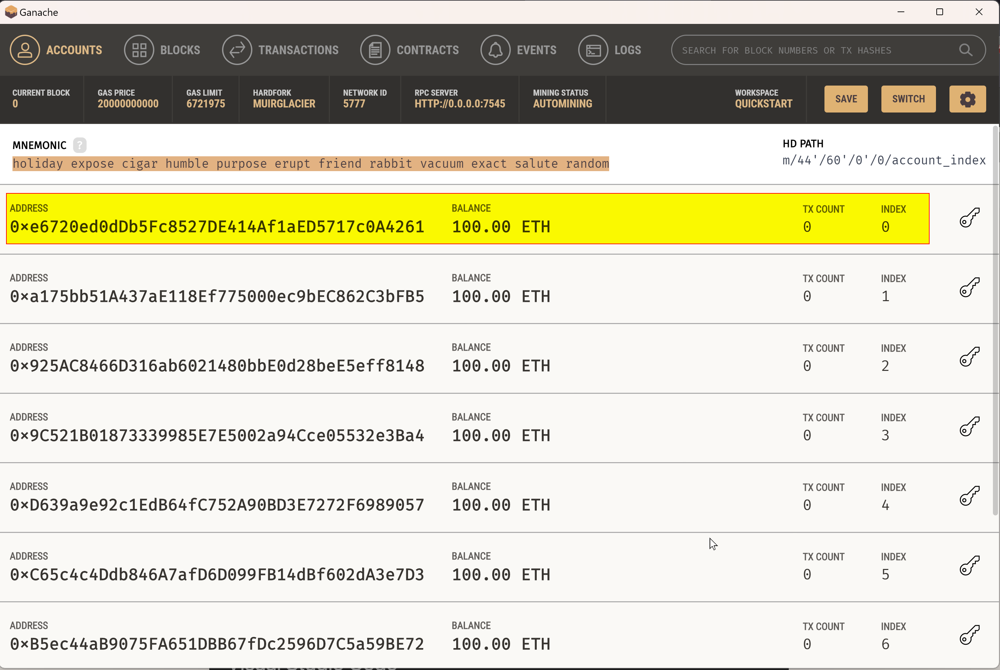
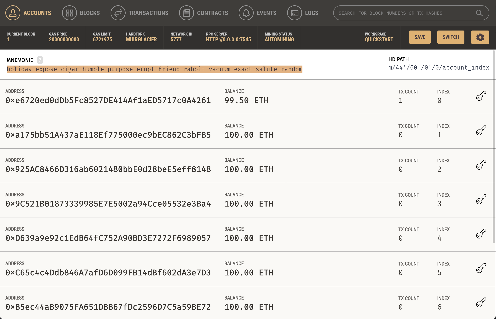
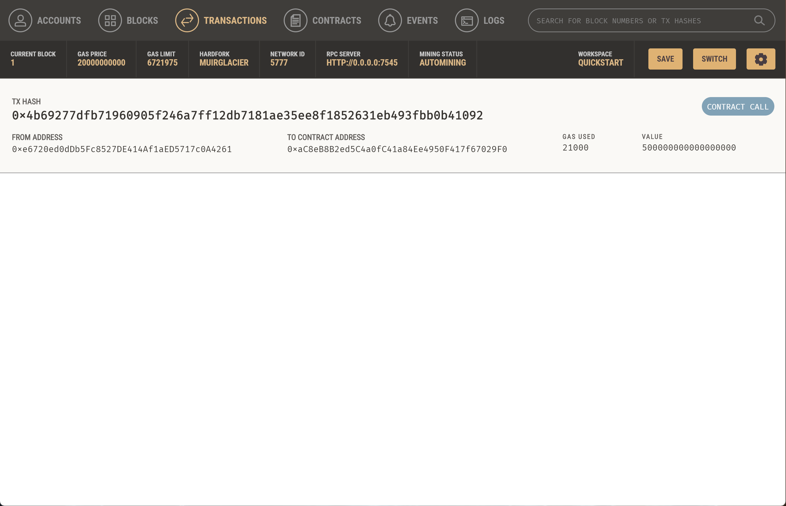
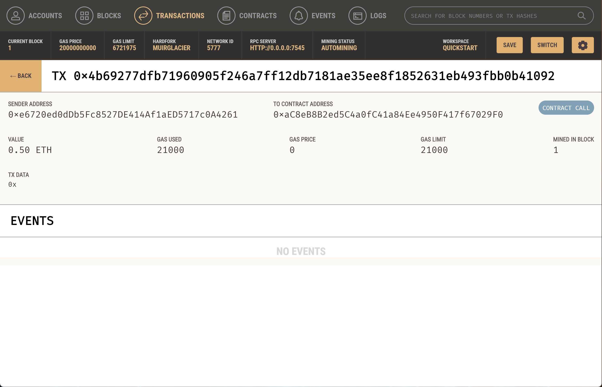
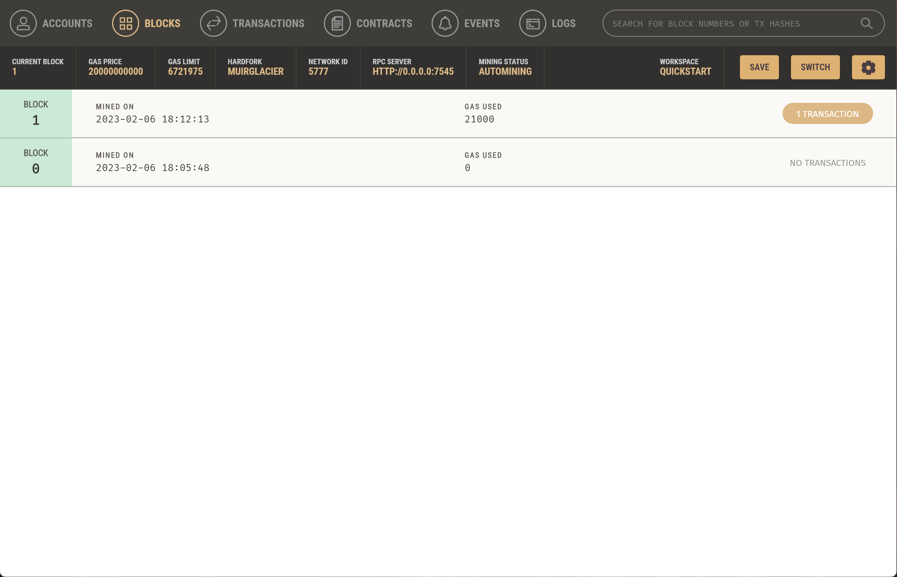
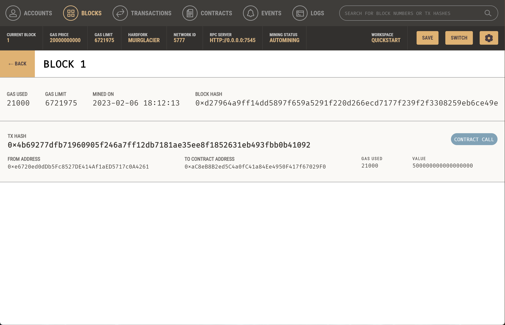

# Krypto2Jobs
KryptoJobs2Go is an application that customers can use to find fintech professionals from among a list of candidates, hire them, and pay them in cryptocurrency.

This initiative integrates the Ethereum blockchain network into the application in order to enable your customers to instantly pay the fintech professionals whom they hire with cryptocurrency.

## Steps
Specifically, a KryptoJobs2Go customer can do the following:
* Generate a new Ethereum account instance by using the mnemonic seed phrase provided by Ganache
* Fetch and display the account balance associated with their Ethereum account address
* Calculate the total value of an Ethereum transaction, including the gas estimate, that pays a KryptoJobs2Go candidate for their work
* Digitally sign a transaction that pays a KryptoJobs2Go candidate, and send this transaction to the Ganache blockchain
* Review the transaction hash code associated with the validated blockchain transaction

## Testing Evidence

### Ganache screen before commencement of testing
The screen below shows the balance of the customer's account prior to testing.  Starting balance is `100.00 ETH`.

### `KryptoJobs2Go` screen prior to commencement of testing
The application user interface also shows the balance of the customer's account prior to testing with a matching starting balance of `100.00 ETH`.

### Testcase 
The testcase is to hire `Lane` for `2.5 hours` showing her wage as calculated to `0.5 ETH`.

### `Hash` validation for the transaction
After the testcase, the application user interface shows the tranasction's `hash` value as proof of validity.

### `Ganache` Balance

The customers balance in `Ganache` and in the `KryptoJobs2Go` also both reflect the customer's new `ETH` balance.

### `Ganache` Transactions and Blocks

An audit trail of the transactions and blockchain created by the transaction is also shown below.

#### Transaction address balance

#### Transaction details

#### Block list

#### Block details
